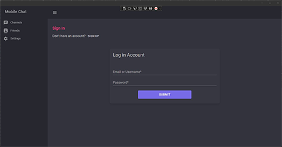
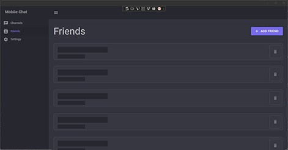
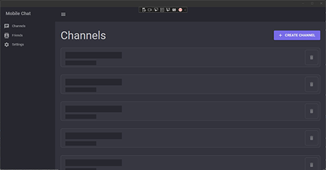
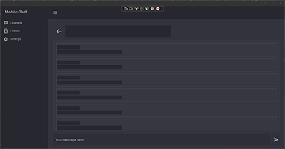
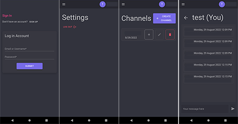

# About
MAUI Client with ASP.NET SignalR Server.

Self-host chatting solution with cross-platform client application.

## MAUI Supported Platforms
- Windows 7 or higher
- macOS 11 or higher
- Android 7.0 (API 24) or higher
- iOS 14 or higher

## WASM Supported Platforms
- Can be deployed to any browser that supports WebAssembly

## Windows

## Android

### Contribution
Feel free to fork and **contribute** or **open an issue**. All contributions are welcome!
